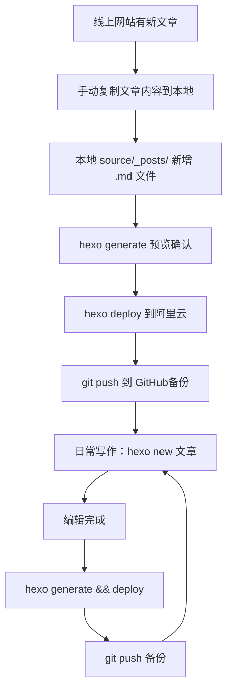

一次性把「源文件备份到 GitHub」+「阿里云站点同步」这两件事做成稳定工作流：可回滚、可迁移、可长期维护。

---

 <!--more-->

---

### 🔹 一、问题背景

你已经找到了本地的 Hexo 博客源文件夹，站点配置（`_config.yml` / 主题配置等）也都设置好了，但现在遇到两个核心问题：

1. **如何把博客源文件部署到 GitHub 仓库进行备份？**
2. **如何与阿里云网站同步？**（网站上的内容可能更新过：需要先把线上“新增文章”同步回本地，再继续写新文章并发布）

---

### 🔹 二、将博客源文件部署到 GitHub 仓库（备份源文件）

> 目标：把 **源文件（写作原材料）** 长期备份到 GitHub，便于多电脑同步、版本回滚、容灾。

#### ▫️ 1、在 GitHub 上创建新仓库

1. 登录 GitHub，点击右上角 `+`，选择 **New repository**
2. **Repository name**：建议 `fluid-blog` / `hexo-blog-source`（**不要**用 `username.github.io`，那个通常用于放静态成品）
3. 选择 **Public** 或 **Private**（按需）
4. 勾选 **Add a README file**
5. 点击 **Create repository**
6. 复制仓库的 **HTTPS 地址**（例如：`https://github.com/用户名/fluid-blog.git`）

#### ▫️ 2、配置本地 Git 并上传源文件

打开 PowerShell / 终端，进入博客根目录（包含 `_config.yml` 的文件夹）：

```bash
# 📌 1) 检查并修改远程仓库地址（如果已有 origin）
git remote -v
git remote set-url origin https://github.com/用户名/fluid-blog.git

# 📌 2) 确认当前分支（建议 main）
git branch

# 📌 3) 创建 .gitignore（忽略不需要上传的目录/文件）
echo "node_modules/" >> .gitignore
echo "public/" >> .gitignore
echo ".deploy_git/" >> .gitignore
echo "db.json" >> .gitignore

# 📌 4) 提交并推送
git add .
git commit -m "备份博客源文件"
git push -u origin main
```

#### ▫️ 3、验证备份成功

访问你的仓库页面，确认以下内容已上传：

- `source/`（文章源文件）
- `themes/`（主题文件）
- `_config.yml`（站点配置）
- `_config.fluid.yml`（主题配置，如有）
- `package.json`（依赖配置）

---

### 🔹 三、解决“本地源文件”与“阿里云站点”同步问题

> 关键点：**阿里云站点通常是静态成品（HTML/CSS/JS）**，不是源文件。  
> 所以：线上有新增文章时，你需要“把文章内容取回本地源文件”，再进行后续发布。

#### ▫️ 1、理解 Hexo 的工作流（先把概念钉牢）

- **本地源文件**：`source/_posts/` 下的 `.md`、主题配置等（写作原材料）
- **阿里云网站文件**：`/var/www/html/` 下的静态网页（生成后的成品）
- **关系**：源文件 → `hexo generate` → 静态文件 → `hexo deploy` → 阿里云

> ⚠️ 执行 `hexo clean && hexo generate && hexo deploy` 会 **覆盖** 阿里云上的静态站点。  
> 如果本地比线上旧，会导致线上新内容被覆盖掉 —— 所以必须先做“同步回本地”。

---

### 🔹 四、安全第一：先检查现状，再动手部署

#### ▫️ 1、检查 SSH 连接与服务器钩子是否存在

```bash
# 📌 测试 SSH，并确认 Git 钩子存在（示例路径）
ssh root@47.111.124.112 "ls -la /var/www/html/.git/hooks/post-receive"
```

#### ▫️ 2、确认本地 `_config.yml` 的部署配置

```yaml
# 📌 Deployment
deploy:
  type: git
  repo: root@47.111.124.112:/var/www/html/.git
  branch: master
```

> 说明：这里的 repo 指向你服务器上的 bare 仓库目录；post-receive 会把内容 checkout 到站点目录。

---

### 🔹 五、把线上“新增文章”同步回本地（关键步骤）

由于线上是静态文件，无法直接“下载源文件”，需要用以下方式把新增文章内容回填到本地：

#### ▫️ 方法 1：手动复制粘贴（推荐，最安全）

1. 访问线上网站（例如 `www.vgtmy.com`），找出比本地新的文章
2. 进入文章详情页，复制 **正文、图片、代码块**
3. 在本地 `source/_posts/` 下新建同名 `.md`
4. 修复 Front-matter（示例）：

```yaml
---
title: 文章标题
date: 2026-03-05 10:00:00
tags: [标签1, 标签2]
categories: [分类]
---
```

5. 下载文章图片，放到 `source/img/` 或你的图床目录，并修改 Markdown 图片链接

#### ▫️ 方法 2：浏览器插件辅助（文章较多时）

1. 安装 Chrome 插件：**MarkDownload** / **Copy as Markdown**
2. 打开线上文章 → 用插件导出 Markdown
3. 粘贴到本地 `.md`
4. 手动检查：Front-matter、图片路径、代码块格式

> **建议配一张“同步回本地”的流程图（AI图也行）**  
> 提示词：  
> “Flowchart illustration: website article -> copy as markdown -> local source/_posts -> hexo generate preview -> hexo deploy, minimal flat style, 16:9, no text”

---

### 🔹 六、配置 SSH 免密登录（可选但推荐）

避免每次部署输入密码：

```bash
# 📌 1) 检查本地 SSH 公钥
ls ~/.ssh/id_rsa.pub

# 📌 2) 没有就生成
ssh-keygen -t rsa -b 4096 -C "your_email@example.com"

# 📌 3) 将公钥添加到服务器
ssh-copy-id root@47.111.124.112
```

---

### 🔹 七、完整同步流程（建议你每次都按这个走）

#### ▫️ 第一步：备份线上网站（保险起见）

```bash
ssh root@47.111.124.112 "cp -r /var/www/html /var/www/html_backup_$(date +%Y%m%d)"
```

#### ▫️ 第二步：手动同步线上新增文章到本地

按「第五部分」的方法，把线上新增文章内容回填到本地 `source/_posts/`

#### ▫️ 第三步：本地生成并预览确认

```bash
hexo clean && hexo generate
hexo server
# 📌 浏览器访问 http://localhost:4000
```

#### ▫️ 第四步：部署到阿里云

```bash
# 📌 如果没装部署插件
npm install hexo-deployer-git --save

# 📌 部署
hexo clean && hexo generate && hexo deploy
```

#### ▫️ 第五步：把源文件推送到 GitHub 备份

```bash
git add .
git commit -m "同步线上新文章到本地"
git push origin main
```

---

### 🔹 八、日常写作与发布（同步完成后的稳定节奏）

#### ▫️ 1、写新文章

```bash
hexo new "我的新文章标题"
# 📌 编辑 source/_posts/我的新文章标题.md
```

#### ▫️ 2、本地预览（可选）

```bash
hexo server
```

#### ▫️ 3、部署到阿里云

```bash
hexo clean && hexo generate && hexo deploy
```

#### ▫️ 4、备份到 GitHub

```bash
git add source/_posts/我的新文章标题.md
git commit -m "新增文章：我的新文章标题"
git push origin main
```

---

### 🔹 九、常见问题与解决方案

#### ▫️ 1、部署时提示 `hexo-deployer-git` 未安装

```bash
npm install hexo-deployer-git --save
```

#### ▫️ 2、SSH 连接提示权限错误

```bash
ssh -v root@47.111.124.112
# 📌 如仍失败：重新生成密钥并 ssh-copy-id
```

#### ▫️ 3、服务器 Git 仓库问题

如果提示：`'/var/www/html/.git' does not appear to be a git repository`：

```bash
ssh root@47.111.124.112
cd /var/www/html
rm -rf .git
git init --bare .git

# 📌 创建 post-receive 钩子
cat > .git/hooks/post-receive << 'EOF'
#!/bin/sh
git --work-tree=/var/www/html --git-dir=/var/www/html/.git checkout -f
EOF

chmod +x .git/hooks/post-receive
chown -R www-data:www-data .git
exit
```

#### ▫️ 4、GitHub 推送冲突

```bash
git pull origin main --allow-unrelated-histories
# 📌 解决冲突后
git push origin main
```

---

### 🔹 十、工作流程图（可直接贴到文章里）



---

### 🔹 十一、重要提醒（写在最后，真的很重要）

1. **线上静态文件不能替代源文件**：线上只有成品，源文件必须靠你自己维护
2. **每次部署前先确认状态**：`git status` 看本地是否有未提交变更
3. **定期备份**：GitHub 作为远程仓库非常稳
4. **测试先行**：本地 `hexo server` 看没问题再部署
5. **不确定先备份**：线上备份 + 本地提交，是最好的保险

